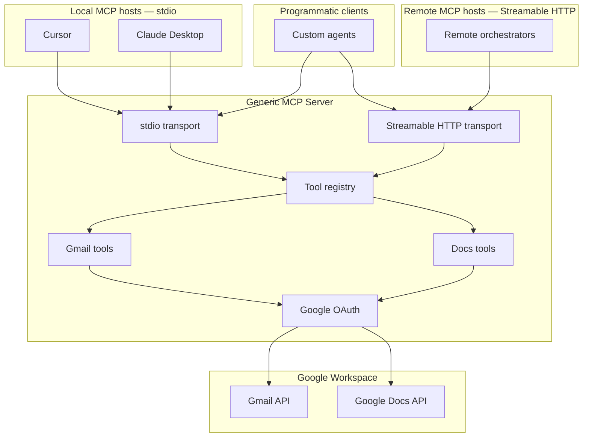
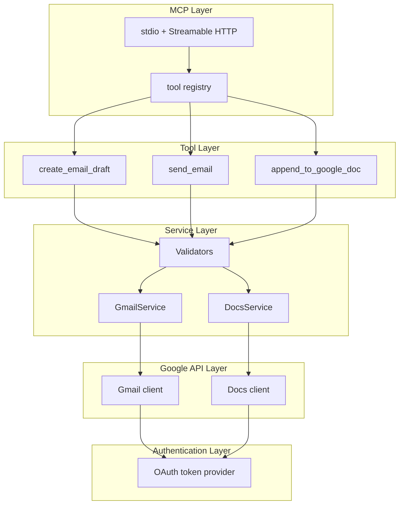
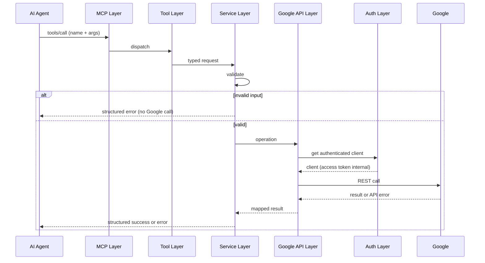
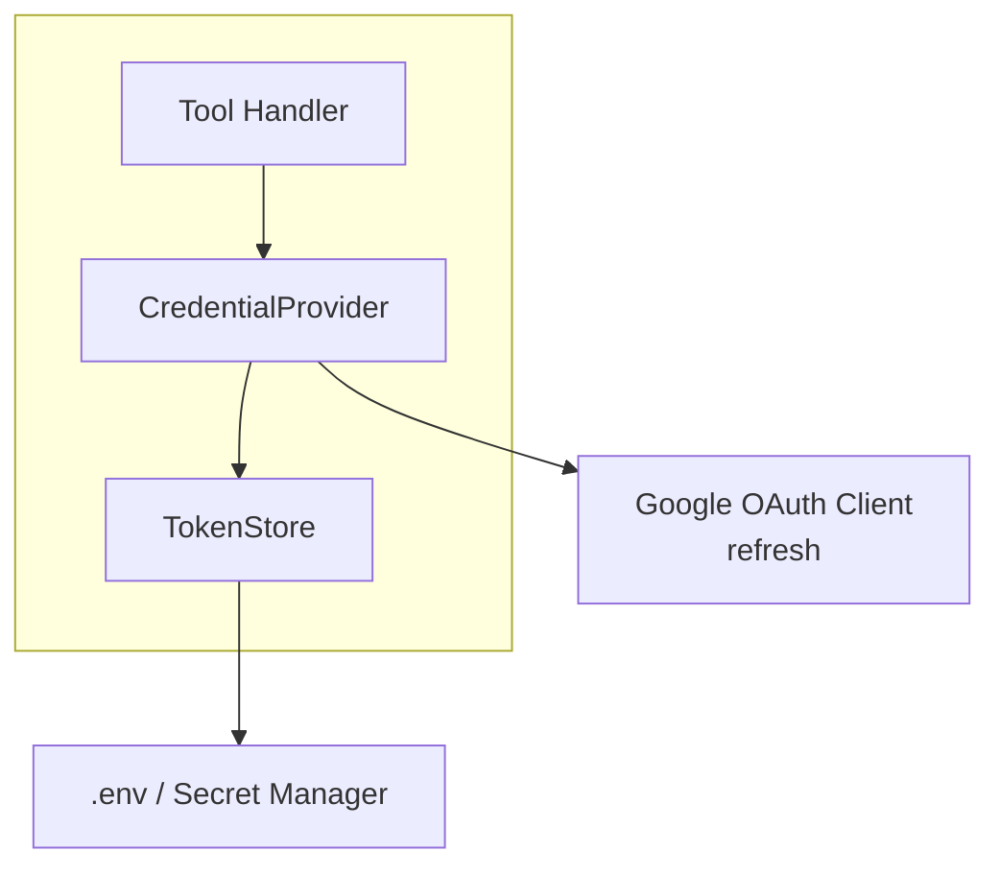
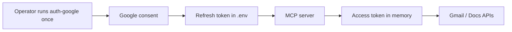

# Architecture — Generic Gmail & Google Docs MCP Server

This document is the system architecture for the standalone MCP server defined in [`problemStatement.md`](./problemStatement.md). The server is an **integration and capability layer**, not an AI agent. Any MCP-compatible client can discover its tools and invoke Gmail and Google Docs operations.

**Contents**

1. [Purpose and scope](#1-purpose-and-scope)
2. [Design principles](#2-design-principles)
3. [System context](#3-system-context)
4. [Layered architecture](#4-layered-architecture)
5. [Request lifecycle](#5-request-lifecycle)
6. [Technology stack](#6-technology-stack)
7. [Repository layout](#7-repository-layout)
8. [MCP tools](#8-mcp-tools)
9. [Component specifications](#9-component-specifications)
10. [Authentication](#10-authentication)
11. [Configuration](#11-configuration)
12. [Error handling](#12-error-handling)
13. [Security](#13-security)
14. [Logging](#14-logging)
15. [Transport and client connection](#15-transport-and-client-connection)
16. [Testing](#16-testing)
17. [Extensibility](#17-extensibility)
18. [Mapping to the problem statement](#18-mapping-to-the-problem-statement)
19. [Definition of done](#19-definition-of-done)

---

## 1. Purpose and scope

**Purpose.** Expose reusable Gmail and Google Docs capabilities as MCP tools so any compatible AI agent can draft/send email and append content to a Google Doc — without embedding Google auth, API clients, or tool schemas inside the agent.

### In scope (v1)

- A standalone MCP server that is independent of any specific agent, prompt, or workflow.
- MCP tool discovery (`tools/list`) with typed input schemas and LLM-readable descriptions.
- Three generic tools: `create_email_draft`, `send_email`, `append_to_google_doc`.
- Google OAuth 2.0 with least-privilege scopes.
- Input validation before any Google API call.
- Structured, secret-free success and error responses.
- Environment-based configuration, `.env.example`, and a `.gitignore` that excludes secrets.
- Unit tests with mocked Google APIs.

### Out of scope (v1)

- Business-specific tools (`create_customer_feedback_report`, `send_customer_feedback_email`).
- LLM calls, prompts, or content generation inside the server.
- Deciding *what* to write in an email or document.
- Coupling to a single AI application (Cursor-only, Claude-only, etc.).
- Reading Gmail, listing Drive files, creating docs, or Sheets (see [§17](#17-extensibility)).

The AI agent owns reasoning and decision-making. This server owns secure execution of external actions.

---

## 2. Design principles

| Principle | Implication |
| --- | --- |
| Agent-independent | No prompts, no workflow IDs, no knowledge of *why* a tool was called. |
| Generic capabilities only | Tools are `send_email` / `create_email_draft` / `append_to_google_doc`, never domain-named. |
| Layered and replaceable | MCP, tools, services, Google clients, and auth are separate modules. |
| Validate before Google | Invalid input never reaches Gmail or Docs APIs. |
| Least privilege | Request only the OAuth scopes required for draft, send, and append. |
| Secrets stay server-side | Tokens and client secrets never appear in MCP responses or logs. |
| Structured I/O | Every success and failure uses a predictable JSON envelope. |
| Easy to extend | A new Workspace tool is a new tool module + service — not a rewrite. |
| Host-agnostic | Same tools and contracts for Cursor, Claude Desktop, custom agents, and remote orchestrators. |

---

## 3. System context

One MCP server is shared by every compatible host. The server does not embed Cursor-specific, Claude-specific, or orchestrator-specific logic. Clients differ only in **how they attach** (local stdio vs remote Streamable HTTP). Tool names, schemas, validation, OAuth, and Google calls stay the same.

The server is the only component that talks to Google.



### 3.1 Compatible clients

| Client | How it connects | What it uses the server for |
| --- | --- | --- |
| **Cursor** | Local MCP host launches this server over **stdio** (e.g. `.cursor/mcp.json`). | IDE agent discovers tools and calls draft / send / append during a chat or agent run. |
| **Claude Desktop** | Desktop app launches this server over **stdio** (Claude MCP config). | Conversation agent invokes the same three tools. |
| **Custom agents** | Any MCP SDK client — **stdio** (child process) or **Streamable HTTP** (URL). | App- or script-owned agents (LangChain, LangGraph, in-house runners) call tools without a Google client of their own. |
| **Remote orchestrators** | Network MCP client over **Streamable HTTP** (not stdio). | Workflow engines, multi-agent routers, or hosted runners in another process or machine invoke the same tools. |

No client receives special tools, prompts, or Google credentials. Cursor, Claude Desktop, a custom agent, and a remote orchestrator all see `create_email_draft`, `send_email`, and `append_to_google_doc`.

### 3.2 Actors

| Actor | Role |
| --- | --- |
| **Cursor** | Local IDE MCP host. Spawns the server, holds env/secrets in host config, calls tools from the editor agent. |
| **Claude Desktop** | Local desktop MCP host. Same stdio contract as Cursor; different config file only. |
| **Custom agent** | Application-owned MCP client (SDK, script, or framework). May attach via stdio or HTTP. |
| **Remote orchestrator** | Out-of-process or cross-network MCP client. Attaches via Streamable HTTP; never requires a local child process. |
| **MCP server** | Validates, authenticates, calls Google, returns results. Never reasons about content or which host called. |
| **Google APIs** | Execute the side effect (draft, send, append). |
| **Operator** | Configures OAuth once, starts the server (stdio and/or HTTP), points each host at it. |

A support workflow (send email), a docs workflow (append), or a combined workflow (draft then append) can run from any of the four clients without server code changes.

### 3.3 Host-independence rules

- Do not import Cursor, Claude, LangChain, or orchestrator APIs inside the server.
- Do not branch on client name, user-agent, or host config.
- Tool descriptions target an LLM/tool-caller, not a specific product UI.
- Local hosts (Cursor, Claude Desktop) and remote hosts (orchestrators) share one tool registry.
- Transport adapters are the only host-facing difference; see [§15](#15-transport-and-client-connection).

---

## 4. Layered architecture

The problem statement requires a clean downward dependency chain. Upper layers never import Google client types; lower layers never know about MCP.

```
MCP Layer
    ↓
Tool Layer
    ↓
Service Layer
    ↓
Google API Layer
    ↓
Authentication Layer
```



| Layer | Responsibility | Must not |
| --- | --- | --- |
| **MCP** | Transport, `tools/list`, `tools/call`, JSON-RPC envelope | Contain Gmail/Docs logic |
| **Tool** | Map MCP arguments ↔ service calls; attach tool name, description, schema | Call Google APIs directly |
| **Service** | Orchestrate validate → API → map result | Know about MCP protocol types |
| **Google API** | Thin wrappers around Gmail/Docs REST clients | Own business validation or auth storage |
| **Authentication** | Load credentials, refresh access tokens, expose an authenticated client | Return tokens to callers above the API layer |

Adding `read_google_doc` later means a new tool + a new service method. The MCP server bootstrap and auth layer stay unchanged.

---

## 5. Request lifecycle

Every tool invocation follows the same path. The server never branches on agent identity or workflow intent.

```
Receive structured request
        ↓
Validate request
        ↓
Authenticate
        ↓
Call Google API
        ↓
Process result
        ↓
Return structured MCP response
```



---

## 6. Technology stack

The problem statement leaves the language open. This architecture selects a stack that meets the stated criteria: official MCP SDK, strong Google API and OAuth support, easy local development, and testability — without extra frameworks.

| Concern | Choice | Rationale |
| --- | --- | --- |
| Runtime | **Node.js 20+** with **TypeScript** | Official MCP TypeScript SDK is the reference implementation; first-class stdio transport. |
| MCP SDK | `@modelcontextprotocol/sdk` | Official, well-supported, used by current MCP clients. |
| Google APIs | `googleapis` | Official Node client for Gmail and Docs; shares one OAuth client. |
| Auth | `google-auth-library` (via `googleapis`) | OAuth 2.0 refresh-token flow; no custom token math. |
| Validation | **Zod** | Runtime schema used both for MCP JSON Schema and service-level checks. |
| Config | `dotenv` + a typed `config` module | Environment-only secrets; fail fast on missing required vars. |
| Tests | **Vitest** (or Node test runner) | Fast unit tests; Google clients mocked. |
| Transport (v1) | **stdio** + **Streamable HTTP** | stdio for Cursor and Claude Desktop; Streamable HTTP for remote orchestrators and HTTP-based custom agents. |

**Rejected for v1**

| Option | Why not now |
| --- | --- |
| HTTP/SSE-only (no stdio) | Would break Cursor and Claude Desktop, which spawn a local process. |
| Express / FastAPI / Nest as the app core | Unnecessary for stdio; HTTP transport may use the MCP SDK's Streamable HTTP helper, not a custom web framework. |
| Embedding an LLM | Violates the “capability layer, not an agent” rule. |

Python (`mcp` + `google-api-python-client`) is an acceptable alternate stack if the implementer prefers it. Layer boundaries and tool contracts in this document stay the same.

---

## 7. Repository layout

```
MCP Server/
├── docs/
│   ├── problemStatement.md
│   └── architecture.md
├── src/
│   ├── index.ts                 # process entry: load config, start stdio and/or HTTP
│   ├── server/
│   │   └── mcp-server.ts        # MCP Server + tool registration
│   ├── tools/
│   │   ├── gmail-tools.ts       # create_email_draft, send_email
│   │   └── google-docs-tools.ts # append_to_google_doc
│   ├── services/
│   │   ├── gmail-service.ts
│   │   └── google-docs-service.ts
│   ├── google/
│   │   ├── gmail-client.ts      # Gmail API wrapper
│   │   └── docs-client.ts       # Docs API wrapper
│   ├── auth/
│   │   └── google-auth.ts       # OAuth client + token refresh
│   ├── config/
│   │   └── configuration.ts
│   ├── errors/
│   │   └── app-error.ts         # typed error codes + MCP mapping
│   └── utils/
│       ├── logger.ts
│       └── validators.ts        # email / documentId helpers
├── scripts/
│   └── auth-google.ts           # one-time OAuth consent → refresh token
├── tests/
│   ├── server/
│   ├── tools/
│   ├── services/
│   └── auth/
├── .env.example
├── .gitignore
├── package.json
├── tsconfig.json
└── README.md
```

The exact file names may follow the chosen language; the **layer split must not**.

---

## 8. MCP tools

### 8.1 Discovery

`tools/list` exposes exactly these v1 tools. Descriptions must be specific enough for an LLM to choose the right one (draft vs send; append vs “create a report”).

| Tool | Purpose |
| --- | --- |
| `send_email` | Send an email through Gmail |
| `create_email_draft` | Create a Gmail draft without sending |
| `append_to_google_doc` | Append content to an existing Google Doc |

### 8.2 Shared email input

Used by both Gmail tools. `send_email` and `create_email_draft` share one schema so agents can reuse the same payload.

| Field | Type | Required | Rules |
| --- | --- | --- | --- |
| `to` | `string[]` | yes | ≥1 address; each must be a valid email |
| `cc` | `string[]` | no | Each value valid if present |
| `bcc` | `string[]` | no | Each value valid if present |
| `subject` | `string` | yes | Non-empty after trim |
| `body` | `string` | yes | Non-empty after trim (plain text) |
| `htmlBody` | `string` | no | Optional HTML alternative |
| `threadId` | `string` | no | Gmail thread id when replying |
| `inReplyTo` | `string` | no | RFC Message-ID for reply headers |

### 8.3 `create_email_draft`

Creates a Gmail draft. Does **not** send.

**Success**

```json
{
  "success": true,
  "draftId": "gmail-draft-id",
  "message": "Email draft created successfully."
}
```

### 8.4 `send_email`

Sends immediately via the Gmail API.

**Success**

```json
{
  "success": true,
  "messageId": "gmail-message-id",
  "threadId": "gmail-thread-id",
  "message": "Email sent successfully."
}
```

### 8.5 `append_to_google_doc`

Appends `content` at the end of an existing document. The server does not interpret markdown; it writes the string as supplied (plain text insert at `endOfSegment`). Agents may pass markdown; rendering is the agent's concern in v1.

| Field | Type | Required | Rules |
| --- | --- | --- | --- |
| `documentId` | `string` | yes | Non-empty; Google Doc id format (alphanumeric, `_`, `-`) |
| `content` | `string` | yes | Non-empty after trim |

**Success**

```json
{
  "success": true,
  "documentId": "google-document-id",
  "message": "Content appended successfully."
}
```

### 8.6 Response envelope

| Outcome | Shape |
| --- | --- |
| Success | `{ "success": true, ...operation fields, "message": string }` |
| Failure | `{ "success": false, "error": { "code": string, "message": string } }` |

`error.code` values are stable (see [§12](#12-error-handling)). Messages are agent-readable and contain no tokens or secrets.

---

## 9. Component specifications

### 9.0 Component diagram

Tool handlers never talk to Google directly. They ask `CredentialProvider` for an authenticated client. Tokens are refreshed by the Google OAuth client and read from `TokenStore` — they are never returned to the MCP caller.



| Box | Ours |
| --- | --- |
| **Tool Handler** | `gmail-tools`, `google-docs-tools` |
| **CredentialProvider** | `src/auth/google-auth` |
| **TokenStore** | Refresh token via env / secret manager — not returned on the wire |
| **Google OAuth Client (refresh)** | `google-auth-library` |
| **.env / Secret Manager** | `GOOGLE_REFRESH_TOKEN` and related config |

### 9.1 MCP Layer (`src/server`)

- Create the MCP `Server`, register the three tools, connect **stdio** and/or **Streamable HTTP** (same registry).
- `tools/list` is generated from the registered tool metadata (name, description, JSON Schema).
- `tools/call` looks up the tool by name, parses arguments with Zod, and invokes the matching service.
- Unknown tool names return a structured MCP error, not a thrown stack trace.
- Startup fails closed if required env vars are missing.

### 9.2 Tool Layer (`src/tools`)

Each tool is a thin adapter:

1. Declare name, description, and input schema.
2. Parse / coerce MCP arguments.
3. Call one service method.
4. Map `AppError` → error envelope; map success DTO → success envelope.

Tools do not construct MIME messages or Docs batchUpdate requests.

### 9.3 Service Layer (`src/services`)

**GmailService**

- `createDraft(input)` / `send(input)`
- Run email validators.
- Delegate MIME construction and API calls to `gmail-client`.
- Return `{ draftId }` or `{ messageId, threadId }`.

**DocsService**

- `append(documentId, content)`
- Run document validators.
- Delegate `documents.get` (end index) + `documents.batchUpdate` (insert) to `docs-client`.
- Return `{ documentId }`.

Services own the validate → call → map sequence. They do not import MCP SDK types.

### 9.4 Google API Layer (`src/google`)

Thin, mockable wrappers.

| Client | Operations |
| --- | --- |
| `gmail-client` | `users.drafts.create`, `users.messages.send` (or `users.drafts.send` if sending an existing draft later) |
| `docs-client` | `documents.get` (to locate append index), `documents.batchUpdate` with `insertText` at end of body |

MIME construction (RFC 2822, base64url) lives here or in a small `utils/mime` helper — not in the tool layer.

### 9.5 Authentication Layer (`src/auth`)

- Build an OAuth2 client from `GOOGLE_CLIENT_ID`, `GOOGLE_CLIENT_SECRET`, `GOOGLE_REDIRECT_URI`, `GOOGLE_REFRESH_TOKEN`.
- Refresh access tokens automatically; cache the authenticated client for the process lifetime.
- Never serialize tokens into logs or return values.
- Map auth/refresh failures to `AUTHENTICATION_FAILED`.

A `scripts/auth-google.ts` helper runs a one-time local consent flow and prints a refresh token for `.env`. That script is operator tooling, not part of the MCP request path.

---

## 10. Authentication

### 10.1 Flow

v1 uses a **pre-authorized refresh token** (installed-app / desktop OAuth). The MCP process is headless; it must not open a browser on every tool call.



1. Operator creates a Google Cloud project, enables **Gmail API** and **Google Docs API**.
2. Operator creates an OAuth client (Desktop or Web) and downloads the client id/secret.
3. Operator runs `scripts/auth-google.ts`, consents, and stores the refresh token in `.env`.
4. The server uses the refresh token to mint access tokens at runtime.

### 10.2 Scopes (least privilege)

| Capability | Scope | Why this one |
| --- | --- | --- |
| Create drafts and send | `https://www.googleapis.com/auth/gmail.compose` | Covers draft + send without `gmail.readonly` or full mailbox modify. |
| Append to existing docs | `https://www.googleapis.com/auth/documents` | Docs API write; no append-only scope exists. |

Do **not** request `gmail.modify`, `mail.google.com`, or `drive` full access in v1.

`gmail.compose` does not let the server read inbox contents. `documents` is required because the agent supplies an existing `documentId` (Drive `drive.file` only covers files the app created).

### 10.3 Token rules

- Credentials are never hardcoded.
- Client secrets and refresh tokens are never committed.
- Access tokens are never returned in MCP responses.
- Refresh and access tokens are never logged.
- Failed refresh → `AUTHENTICATION_FAILED`, no retry storm.

---

## 11. Configuration

All secrets and environment-specific values come from the environment. Nothing that affects Google identity is hardcoded.

`.env.example`

```dotenv
GOOGLE_CLIENT_ID=
GOOGLE_CLIENT_SECRET=
GOOGLE_REDIRECT_URI=http://localhost:3000/oauth2callback
GOOGLE_REFRESH_TOKEN=
LOG_LEVEL=info
```

| Variable | Required | Purpose |
| --- | --- | --- |
| `GOOGLE_CLIENT_ID` | yes | OAuth client id |
| `GOOGLE_CLIENT_SECRET` | yes | OAuth client secret |
| `GOOGLE_REDIRECT_URI` | yes | Must match the Cloud Console client |
| `GOOGLE_REFRESH_TOKEN` | yes (runtime) | Headless access; obtained via `auth-google` |
| `LOG_LEVEL` | no | `debug` \| `info` \| `warn` \| `error` |

Startup validates required variables and exits with a clear message if any are missing. `.env` is loaded only when present; production may inject env vars without a file.

---

## 12. Error handling

Errors are structured, predictable, safe, useful to the agent, and free of secrets.

### 12.1 Error codes

| Code | When | HTTP/Google origin (typical) |
| --- | --- | --- |
| `VALIDATION_ERROR` | Schema or field rules fail (missing `to`, empty `content`, bad email) | Local, before Google |
| `INVALID_EMAIL` | One or more addresses fail format checks | Local |
| `DOCUMENT_NOT_FOUND` | Doc missing or inaccessible | Docs 404 / 403 |
| `AUTHENTICATION_FAILED` | Missing/invalid refresh token, revoked consent, refresh error | Auth library / 401 |
| `GOOGLE_API_ERROR` | Other Gmail/Docs failures | 4xx/5xx from Google |
| `UNKNOWN_TOOL` | `tools/call` name not registered | Local |

### 12.2 Envelope examples

**Authentication**

```json
{
  "success": false,
  "error": {
    "code": "AUTHENTICATION_FAILED",
    "message": "Unable to authenticate with Google."
  }
}
```

**Invalid email**

```json
{
  "success": false,
  "error": {
    "code": "INVALID_EMAIL",
    "message": "The recipient email address is invalid."
  }
}
```

**Document not found**

```json
{
  "success": false,
  "error": {
    "code": "DOCUMENT_NOT_FOUND",
    "message": "The specified Google document could not be found or accessed."
  }
}
```

**Google API failure**

```json
{
  "success": false,
  "error": {
    "code": "GOOGLE_API_ERROR",
    "message": "Google API request failed."
  }
}
```

### 12.3 Mapping rules

- Validation failures **never** call Google.
- Google 401 / invalid_grant → `AUTHENTICATION_FAILED`.
- Google 404 (docs) or 403 with “not found” → `DOCUMENT_NOT_FOUND` (do not leak whether the file exists vs permission-denied beyond the stated message).
- All other Google errors → `GOOGLE_API_ERROR` with a sanitized message (no request dumps, no tokens).
- Unexpected exceptions → `GOOGLE_API_ERROR` or a generic internal message; stack traces go to logs only.

---

## 13. Security

| Control | Implementation |
| --- | --- |
| No hardcoded credentials | Config module reads env only |
| Secrets out of git | `.gitignore` includes `.env`, `.env.*`, `credentials.json`, `token.json` (allow `.env.example`) |
| Tokens never returned | Response DTOs omit auth fields; sanitizer strips `Authorization` |
| Tokens never logged | Logger redacts `access_token`, `refresh_token`, `client_secret` |
| Input validation | Zod + email / documentId checks before API calls |
| Least-privilege scopes | `gmail.compose` + `documents` only |
| HTTPS to Google | Official clients use TLS; no custom HTTP to Google |
| Email body not logged | Default log line is tool name + outcome, not subject/body/content |

`.gitignore` (required entries):

```
.env
.env.*
!.env.example
credentials.json
token.json
```

---

## 14. Logging

Operational logs help the operator; they must not become a secret store.

**May log**

```
Tool invoked: send_email
Tool invoked: create_email_draft
Tool invoked: append_to_google_doc
Validation failure
Authentication failure
Google API request successful
Google API request failed
```

**Must never log**

- OAuth tokens, client secrets, refresh tokens, passwords
- Email `body` / `htmlBody` / subject (unless an explicit debug flag is documented and off by default)
- Document `content`

A typical info line: `[send_email] success messageId=…` or `[append_to_google_doc] DOCUMENT_NOT_FOUND`. Recipient lists may be omitted or truncated; do not dump full payloads at `info`.

---

## 15. Transport and client connection

The MCP layer exposes **two transports** so the clients in [§3](#3-system-context) can all attach. Tool, service, Google, and auth layers are transport-agnostic.

| Transport | Clients | Binding |
| --- | --- | --- |
| **stdio** | Cursor, Claude Desktop, custom agents that spawn a child process | Host launches `node dist/index.js`; JSON-RPC on stdin/stdout; **logs on stderr** |
| **Streamable HTTP** | Remote orchestrators, custom agents that already run elsewhere | Server listens on a configured host/port; client uses the MCP HTTP URL |

### 15.1 stdio (Cursor, Claude Desktop, local custom agents)

**Start (development)**

```bash
npx tsx src/index.ts
```

or a compiled `node dist/index.js`.

Hosts differ in config file shape; the contract is command + args + env.

**Cursor** (`.cursor/mcp.json` or Cursor MCP settings) and **Claude Desktop** (`claude_desktop_config.json`) both use:

```json
{
  "mcpServers": {
    "gmail": {
      "command": "node",
      "args": ["dist/index.js"],
      "envFile": ".env"
    }
  }
}
```

A **custom agent** can spawn the same command via the official MCP client SDK (`StdioClientTransport`) with the same env.

### 15.2 Streamable HTTP (remote orchestrators and HTTP custom agents)

Remote orchestrators must not depend on a locally spawned child process. Start an HTTP entrypoint that serves the same tool registry:

```bash
npx tsx src/index.ts --transport http --port 8787
```

The orchestrator (or a remote custom agent) connects with the MCP Streamable HTTP client to `http://127.0.0.1:8787/mcp` (path and bind address are configurable).

- Keep the tool/service layers unchanged; only the MCP transport adapter differs.
- Do not expose the HTTP port on a public network without TLS and an access control mechanism (e.g. bind to loopback, reverse proxy, or a shared secret header).
- Cursor and Claude Desktop continue to use stdio; they are not required to call HTTP.

### 15.3 Production considerations

- Prefer injecting env from a secret manager rather than a committed file.
- stdio is process-local to Cursor / Claude Desktop / a local agent.
- Streamable HTTP is for remote orchestrators; treat it as an internal capability endpoint, not a public Google API proxy.
- Restart the process after rotating the refresh token.

---

## 16. Testing

Google APIs are **mocked** in unit tests. Integration tests against live Google are optional and gated on real credentials.

| Area | Cases |
| --- | --- |
| **MCP server** | Startup with valid env; fail-fast on missing env; `tools/list` returns the three tools; schemas validate; unknown tool → `UNKNOWN_TOOL`; invalid args never call services |
| **Gmail** | Email validation (missing `to`, bad address, empty subject/body, invalid cc/bcc); draft creation maps `draftId`; send maps `messageId`/`threadId`; Gmail API errors → `GOOGLE_API_ERROR`; auth failure → `AUTHENTICATION_FAILED` |
| **Google Docs** | Missing/empty `documentId` or `content`; document id format; append success; 404 → `DOCUMENT_NOT_FOUND`; permission/API errors; auth failure |
| **Auth** | Refresh failure mapping; token values absent from returned objects |
| **Logger** | Redaction of token-like fields |

Mocks replace `gmail-client` and `docs-client` (or the `googleapis` factory). Tests must not require network access.

---

## 17. Extensibility

New Workspace capabilities are new **generic** tools. Do not add agent-specific or workflow-specific names.

```
read_google_doc
search_google_drive
create_google_doc
update_google_doc
list_gmail_messages
search_gmail
get_gmail_thread
create_google_sheet
append_to_google_sheet
```

**How to add a tool**

1. Add a service method (and client wrapper if needed).
2. Register a tool with name, description, and Zod/JSON schema.
3. Request any *additional* OAuth scope only if required; keep existing tools on current scopes.
4. Add unit tests with mocks.

The MCP bootstrap, transport, error envelope, and auth provider stay stable. The architecture must not assume a single agent or a single workflow.

---

## 18. Mapping to the problem statement

| Requirement | Architecture section |
| --- | --- |
| Standalone, agent-independent MCP server | §1, §3 |
| `create_email_draft` / `send_email` / `append_to_google_doc` | §8 |
| Tool discovery with schemas | §8.1, §9.1 |
| Validate before Google APIs | §5, §9.3, §12 |
| OAuth 2.0, no hardcoded secrets | §10, §11, §13 |
| Structured errors | §8.6, §12 |
| Layered project structure | §4, §7 |
| stdio (Cursor, Claude Desktop) and Streamable HTTP (remote orchestrators) | §3, §15 |
| Logging without secrets | §14 |
| Mocked unit tests | §16 |
| README / `.env.example` / `.gitignore` | §7, §11, §13 (implemented in repo files) |
| Future generic tools without rewrite | §17 |
| Server is not an AI agent | §1, §2, §5 |

---

## 19. Definition of done

A v1 implementation matches this architecture when:

1. The MCP server starts and MCP-compatible clients can connect: Cursor and Claude Desktop over stdio, custom agents over stdio or HTTP, remote orchestrators over Streamable HTTP.
2. `tools/list` returns `send_email`, `create_email_draft`, and `append_to_google_doc` with typed schemas.
3. An agent can create a Gmail draft and send an email (`to` / `cc` / `bcc` / subject / body).
4. An agent can append caller-supplied content to a Google Doc by `documentId`.
5. Invalid input is rejected locally; Gmail and Docs errors and auth failures return the envelopes in §12.
6. No credentials are hardcoded; `.env` / tokens are gitignored; tokens never appear in responses or logs.
7. Layers are separated as in §4; unit tests mock Google; `.env.example` and README cover setup, OAuth, client connection, and troubleshooting.
8. Another MCP-compatible agent can use the same server with no server-side workflow changes.

---

*This architecture is the implementation blueprint for [`problemStatement.md`](./problemStatement.md). The server executes generic Google Workspace actions; AI agents decide when and why to call them.*
